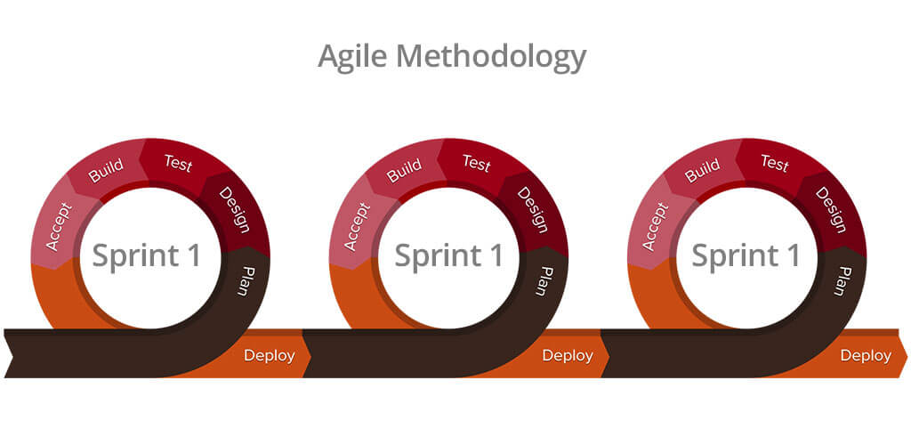
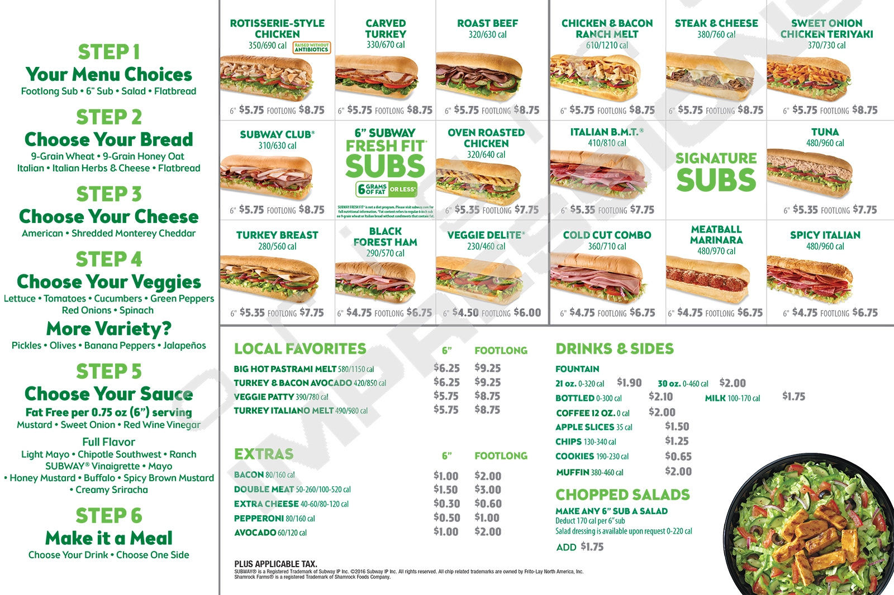

## What is Software Engineering?
Software engineering is the creation of software systems and applications. It includes designing, developing, testing, deploying, and maintaining. Software engineering also involves many fundamental concepts including coding standards, design patterns, agile project management, and ethics. 

## Agile Project Management

     
A critical concept in software engineering is project management, which is a way of managing a team to complete a project as efficiently as possible. A project management model used in software engineering is Agile Project Management. Agile Project Management is a cycle that usually consists of planning, designing, developing, testing, releasing, and getting feedback. Its main benefit is that it allows flexibility and adaptability as it’s a process of iteratively reassessing and creating. Moreover, these project management practices can be adjusted to fit your needs. For example, a custom agile project management process is issue-driven project management. It has been adjusted for a team of around 10 people and a project of no more than half a million lines of code. Agile project management can be used for other projects other than software projects such as the creation of products like cars, phones, computers, etc. The creation of such products may be managed by an iterative approach of planning, creating, and most importantly receiving feedback for continued product improvement. Examples include the new iPhones and Galaxy phones that come out every year. They are iteratively coming out with working products that get improved year after year. Additionally, there wasn’t a set plan from the very beginning for how a phone will be made but phones have just been iteratively reevaluated and improved on each time.

## Design Patterns

Another vital concept in software engineering is design patterns. Design patterns are template solutions to common problems. You can think of them like blueprints and they mainly result in safer and time-saving solutions. Examples of design patterns in real life include the creation of cars and food. Specifically, when creating food like a cheeseburger, you have a general template for creating them. You usually have your buns, some sort of patty in between, and then cheese and other condiments on top of the patty. Another great example is creating a sub sandwich from Subway. Subway has a general template for creating a sub from the process of choosing the bread you want, to the cheese, and then the veggies. This way of creating a sandwich is very efficient and is a proven method of creating a sub sandwich. You did not have to completely invent a new sandwich each time.
