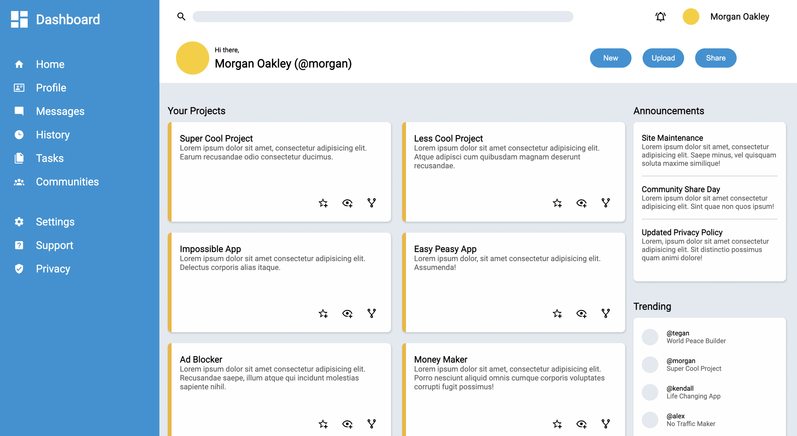

Admin Dashboard is a website that I developed using HTML and CSS. It has several different sections such as the navigation, header, and projects section. There are also elements such as buttons, headings, and icons. All these sections and elements need to be positioned and organized correctly on the web page, and to do that you can use either FlexBox or CSS Grid (I used both).
 
This project is an assignment from an online curriculum called [The Odin Project](https://www.theodinproject.com/). There I was given a guideline, tips, or any other resources needed to create the project all on my own.

This project taught me how and when to use FlexBox and CSS Grid. Instead of choosing one or the other like some do, I learned to use them together and using whichever is better depending on the task. Flexbox and CSS Grid has their own strengths and weaknesses, and this project helped me experience having to make those decisions of choosing which tool to use.

View the code: [https://github.com/GrandeJames/admin-dashboard](https://github.com/GrandeJames/admin-dashboard)
See it live: [https://grandejames.github.io/admin-dashboard/](https://grandejames.github.io/admin-dashboard/)
