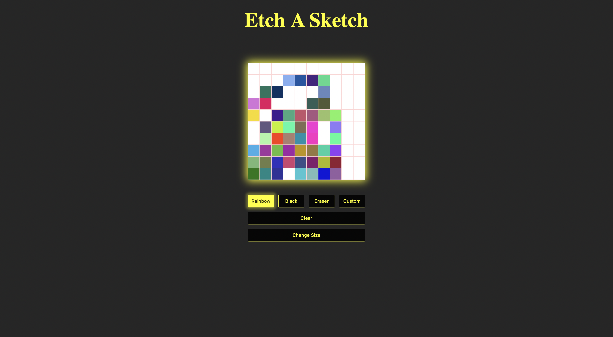

Etch A Sketch is a web app that I developed using HTML, CSS, and JavaScript. There you can sketch on a grid (or sketchpad), and you have options to change the color you’re sketching with to rainbow, black, or your own color of your choosing. You may also erase, clear the grid, and change the size of the cells of the grid.

This is a project from an online curriculum called The Odin Project. I was taught what I needed to know and was given any other information to complete the project all on my own.
 
I struggled with this project initially, but I learned a good amount from it. It was one of the first projects that I had to do using JavaScript and I was still an amateur with HTML and CSS, which was tricky because I had to use all these technologies together. I also struggled with the CSS Grid because I was new to it, and I didn’t have enough knowledge on it, so I just pieced it together, which I feel was the wrong approach because I didn’t completely understand what I was doing. Time has passed and the curriculum got updated, and I knew right I away that I needed to learn it more thoroughly.

View the code: [https://github.com/GrandeJames/etch-a-sketch](https://github.com/GrandeJames/etch-a-sketch)
See it live: [https://grandejames.github.io/etch-a-sketch/](https://grandejames.github.io/etch-a-sketch/)
