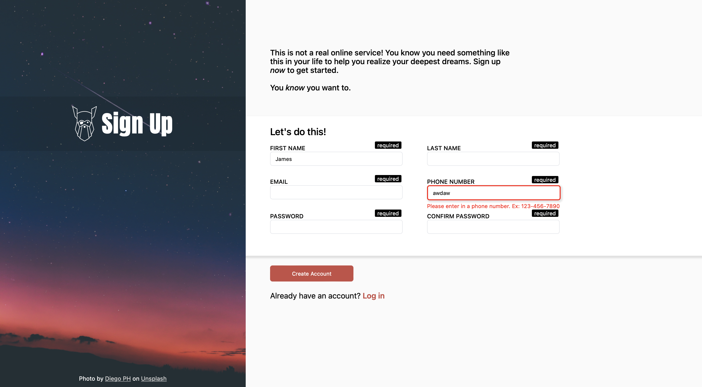

Sign Up is a website that I created using just HTML and CSS, and it’s a form that you need to fill out to create an account. This, however, is simply a form, and it doesn’t create an account or save any information. The website takes in input such as your name, email, and password, and it validates them. If an input entered is wrong, it shows an error message and prevents you from creating the account. For example, when inputting a phone number, it must follow the correct format of 123-456-7890, else it will show an error message underneath the phone number input text area. Additionally, all required inputs necessary to create an account have a required input label on top of each text input. 

This project is an assignment from an online curriculum called [The Odin Project](https://www.theodinproject.com/). There I was given a guideline, tips, or any other resources needed to create the project all on my own.

Creating this project was impactful on my learning in web development. I learned how to create forms that take in input and validate it, then I practice what I learned by creating a working version of it.

View the code: [https://github.com/GrandeJames/sign-up-form](https://github.com/GrandeJames/sign-up-form)
See it live: [https://grandejames.github.io/sign-up-form/](https://grandejames.github.io/sign-up-form/)
