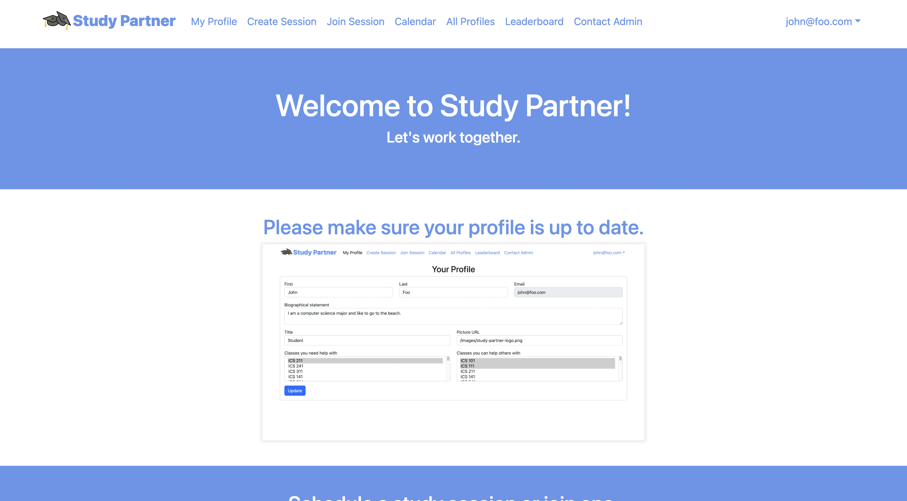

## Project Overview

Study partner is a web app that I and four other students developed, and it allows UH Manoa students to create and participate in study sessions around all the UH Manoa computer science classes to enhance learning by promoting collaboration. Users can create a profile, create and join study sessions, and more. Additionally, our web app has other pages: sign up/in, landing, home, calendar, all profiles, leaderboard, view reports, and contact admin. The technologies used to create this includes Javascript, React, Meteor, Bootstrap, TestCafe, HTML, and CSS.
Images

     

## My Contributions

My main contributions toward the development of the app include working on some of the pages, style sheet, footer, some of the testing, and also providing solutions/fixes. The pages I worked on or helped with are the landing, home, all profiles, create session, and join session pages. For example, I worked on the form for the create session page. There I helped with the date, time, and duration inputs. Working on the create session page also involved me working with the sessions collection. Another thing I helped contribute was making the app more functional such as preventing the user from going to the landing page if logged in and also automatically redirecting to the landing page after signing out.

## What I learned

I’ve learned a lot from this project such as project structure, database, frameworks, and most importantly teamwork. Working and communicating well as a team to complete the project was by far the most valuable experience I had because of the significance of making decisions as a team, and getting and/or giving help. Specifically, I learned that making decisions as a team is sometimes difficult because of differing ideas, but even with that, we were still able to express our opinions, make a decision, and complete the project. It is very different working by yourself and working with a team. Collaboration and communication are vital.

Check out our [project home page](https://study-partner.github.io/) to see the source code and learn more about it.
